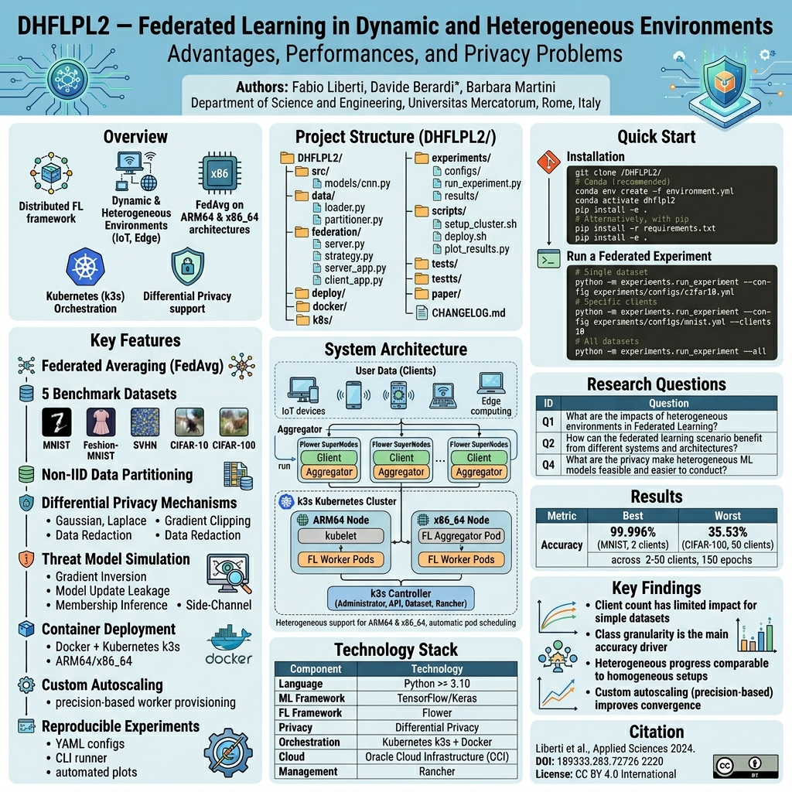
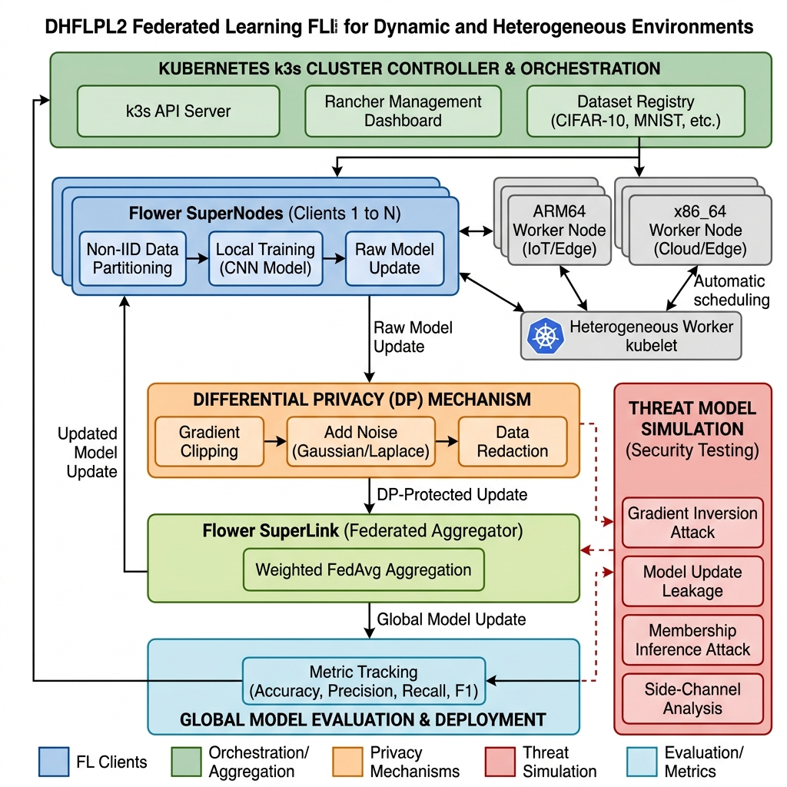

# DHFLPL2 — Federated Learning in Dynamic and Heterogeneous Environments

> **Advantages, Performances, and Privacy Problems**

[](https://doi.org/10.3390/app14188490)
[](https://creativecommons.org/licenses/by/4.0/)
[](https://www.mdpi.com/journal/applsci)
[](https://python.org)

---

## Authors

**Fabio Liberti**, **Davide Berardi**\*, **Barbara Martini**

Department of Science and Engineering, Universitas Mercatorum, 00186 Rome, Italy

\* Correspondence: davide.berardi@unimercatorum.it

---

## Overview

A distributed Federated Learning (FL) framework designed for dynamic and heterogeneous environments characterized by Internet of Things (IoT) devices and Edge Computing infrastructures. The system enables decentralized model training across multiple devices while preserving data privacy, addressing the challenges posed by diverse device capabilities, varying network conditions, and non-IID data distributions.

The framework implements the Federated Averaging (FedAvg) algorithm on heterogeneous architectures (ARM64 + x86_64) orchestrated via Kubernetes (k3s), with Differential Privacy mechanisms to mitigate privacy leakage threats including gradient inversion, model update leakage, membership inference, and side-channel attacks.

**Paper:** Liberti, F.; Berardi, D.; Martini, B. *Federated Learning in Dynamic and Heterogeneous Environments: Advantages, Performances, and Privacy Problems.* Applied Sciences **2024**, 14(18), 8490.

---

## Table of Contents

- [DHFLPL2 — Federated Learning in Dynamic and Heterogeneous Environments](#dhflpl2--federated-learning-in-dynamic-and-heterogeneous-environments)
  - [Authors](#authors)
  - [Table of Contents](#table-of-contents)
  - [Overview](#overview)
  - [Infographic](#infographic)
  - [Methodological Diagram](#methodological-diagram)
  - [Research Questions](#research-questions)
  - [Features](#features)
  - [System Architecture](#system-architecture)
  - [Federated Averaging (FedAvg)](#federated-averaging-fedavg)
  - [Differential Privacy](#differential-privacy)
  - [Privacy Threat Model](#privacy-threat-model)
  - [Datasets](#datasets)
  - [Heterogeneous Architecture](#heterogeneous-architecture)
  - [Dimensions of Heterogeneity](#dimensions-of-heterogeneity)
  - [Results](#results)
    - [Key Findings](#key-findings)
  - [Technology Stack](#technology-stack)
  - [Project Structure](#project-structure)
  - [Quick Start](#quick-start)
    - [Installation](#installation)
  - [Running Experiments](#running-experiments)
    - [Single Experiment](#single-experiment)
    - [All Experiments](#all-experiments)
    - [Generate Plots](#generate-plots)
  - [Privacy \& Threat Model Demos](#privacy--threat-model-demos)
    - [Experimental Demos (real ML training on real datasets)](#experimental-demos-real-ml-training-on-real-datasets)
    - [Utility Demo (functional demonstration, no ML training)](#utility-demo-functional-demonstration-no-ml-training)
  - [Docker Deployment](#docker-deployment)
  - [Kubernetes (k3s) Deployment](#kubernetes-k3s-deployment)
    - [Cluster Setup](#cluster-setup)
    - [Deploy and Scale](#deploy-and-scale)
  - [Overnight Batch Execution](#overnight-batch-execution)
  - [Citation](#citation)
  - [License](#license)

---

## Infographic



*Figure: Project overview infographic showing the framework architecture, key features, research questions, experimental results, and technology stack. The infographic summarizes the complete DHFLPL2 system: from data partitioning across federated clients, through the FedAvg aggregation process on heterogeneous k3s-orchestrated nodes, to the differential privacy mechanisms that protect user data during distributed training.*

---

## Methodological Diagram



*Figure: Detailed methodological flow of the DHFLPL2 framework. The diagram illustrates the complete pipeline: (1) the Kubernetes k3s cluster controller managing orchestration, Rancher dashboard, and dataset registry; (2) Flower SuperNodes performing non-IID data partitioning, local CNN training, and raw model updates on heterogeneous ARM64/x86_64 worker nodes; (3) the Differential Privacy mechanism applying gradient clipping, Gaussian/Laplace noise, and data redaction to protect model updates; (4) the threat model simulation layer testing against gradient inversion, model update leakage, membership inference, and side-channel attacks; (5) the Flower SuperLink performing weighted FedAvg aggregation; and (6) the global model evaluation tracking accuracy, precision, recall, and F1 metrics.*

---

## Research Questions

This work addresses four core research questions through the implementation and experimental evaluation of the framework:

| ID | Question | Addressed in |
|----|----------|-------------|
| **Q1** | What are the impacts of heterogeneous environments in Federated Learning? | Sections 2.2, 5, 6 |
| **Q2** | How can the federated learning scenario benefit from different systems and architectures? | Sections 5.1, 5.2 |
| **Q3** | What are the privacy implications of using federated learning? | Sections 2.3, 4.2 |
| **Q4** | How can a cluster management system (i.e., Kubernetes) make the application of heterogeneous machine learning models feasible and easier to conduct? | Sections 5.1, 5.2 |

---

## Features

- **Federated Averaging (FedAvg)** — weighted aggregation across heterogeneous clients (Algorithm 1)
- **5 benchmark datasets** — CIFAR-10, CIFAR-100, MNIST, Fashion-MNIST, SVHN
- **Non-IID data partitioning** — realistic federated data distribution across nodes
- **Differential Privacy** — (ε, δ)-DP with Gaussian/Laplace noise, gradient clipping, and data redaction
- **Threat model simulation** — Gradient Inversion, Model Update Leakage, Membership Inference, Side-Channel analysis
- **Container deployment** — Docker + Kubernetes (k3s) with ARM64 and x86_64 support
- **Custom autoscaling** — precision-based automatic worker provisioning (threshold at 50%)
- **Reproducible experiments** — YAML configs, CLI runner, automated plot generation
- **Privacy demos** — executable demonstrations of all attack vectors and DP mechanisms

---

## System Architecture

The system is built on a multilayer architecture using Docker and Kubernetes (k3s), as described in Section 5 of the paper:

```
┌─────────────────────────────────────────────────────────┐
│                    User Data (Clients)                  │
├─────────────┬─────────────┬─────────────┬───────────────┤
│  Flower     │  Flower     │  Flower     │  Flower       │
│  SuperNode  │  SuperNode  │  SuperNode  │  SuperNode    │
├─────────────┼─────────────┼─────────────┼───────────────┤
│  kubelet    │  kubelet    │  kubelet    │  kubelet      │
│ FL aggreg.  │ FL worker 1 │ FL worker 2 │ FL worker 3   │
├─────────────┴─────────────┴─────────────┴───────────────┤
│  k3s controller: Administrator │ API │ Dataset │ Rancher│
└─────────────────────────────────────────────────────────┘
```

The architecture is composed of the following building blocks:

- **Cluster of VMs in the cloud** — VMs on Oracle Cloud Infrastructure (OCI) providing isolation and computational resources. Each VM hosts multiple containers, separating hardware from the application layer.
- **Container orchestrator (Docker + k3s)** — Docker provides containerization; k3s (lightweight Kubernetes) handles orchestration, deployment, scaling, and operation of containers across heterogeneous hosts.
- **Federated learning module (Flower)** — The FL module handles communication between participants, model aggregation, and local model updating via the SuperLink (aggregator) and SuperNode (worker) architecture.
- **Data management module** — Pre-processes data, distributes it to participants in a non-IID fashion, and ensures data privacy through normalization, anonymization, and encryption.

---

## Federated Averaging (FedAvg)

The system implements the FedAvg algorithm (Section 4.1, Algorithm 1), where the global model is updated as:

```
w_{t+1} = Σ_{k=1}^{K} (n_k / n) * w_{t+1}^k
```

where *K* is the total number of participating devices, *n_k* is the number of data samples on device *k*, *n* is the total number of samples across all devices, and *w_{t+1}^k* is the weight vector of the local model updated by device *k* at round *t+1*.

The FedAvg process operates in five steps:

1. **Initialization** — The central server initializes the global model and distributes it to all participating clients.
2. **Local Training** — Each client trains the model locally on its data for a predefined number of epochs (1 epoch per round in our experiments).
3. **Sending Weights** — Clients send their updated weights to the central server. Only model weights are transferred; raw data remains on local devices.
4. **Aggregation** — The server collects all updated weights and calculates the weighted average to update the global model.
5. **Iteration** — This process repeats for a predefined number of rounds (150 in our experiments) until convergence.

---

## Differential Privacy

Privacy is enforced through (ε, δ)-differential privacy (Section 4.2, Equation 4):

```
Pr[M(D) ∈ S] ≤ e^ε * Pr[M(D') ∈ S] + δ
```

where *M* is the randomized mechanism, *D* and *D'* are datasets differing by one element, *ε* is the privacy budget, and *δ* is a small probability.

The implementation provides two privacy actions as described in Section 5.2:

1. **Data Redaction** — Removal of private data (email addresses, phone numbers, home addresses) from datasets before processing. If an application wants to avoid privacy leaks, the blocklist should be implemented.
2. **Noise Augmentation** — The dataset is augmented with calibrated noise (Gaussian or Laplace mechanism) to prevent recognition of private numerical values, such as those found in Electronic Medical Records or Account Statements.

The complete DP pipeline for model weights applies: (1) gradient clipping to bound sensitivity, then (2) calibrated Gaussian noise addition.

---

## Privacy Threat Model

The system addresses four attack vectors identified in Section 4.2 of the paper:

| Attack | Description | Mitigation |
|--------|-------------|------------|
| **Gradient Inversion** | Reconstruction of original data from shared gradients by minimizing the difference between computed and guessed gradients | Differential Privacy noise on gradients |
| **Model Update Leakage** | Inference from repeatedly shared model updates; an attacker accumulates information over time | DP noise + gradient clipping reduces signal |
| **Side-Channel** | Exploitation of timing or communication size metadata to gain insights into data being processed | Uniform communication patterns |
| **Membership Inference** | Determining whether a data point was part of the training set by analyzing output confidence scores | DP reduces overfitting to training data |

---

## Datasets

Experiments were conducted across five benchmark datasets with 2 to 50 federated clients over 150 epochs (Section "Results"):

| Dataset | Classes | Input Shape | Description | Source |
|---------|---------|-------------|-------------|--------|
| **CIFAR-10** | 10 | 32×32×3 | Color images (primary benchmark) | [cs.toronto.edu](https://www.cs.toronto.edu/~kriz/cifar.html) |
| **CIFAR-100** | 100 | 32×32×3 | Fine-grained color images | [cs.toronto.edu](https://www.cs.toronto.edu/~kriz/cifar.html) |
| **MNIST** | 10 | 28×28×1 | Handwritten digits | [yann.lecun.com](http://yann.lecun.com/exdb/mnist/) |
| **Fashion-MNIST** | 10 | 28×28×1 | Clothing items | [fashion-mnist](http://fashion-mnist.s3-website.eu-central-1.amazonaws.com/) |
| **SVHN** | 10 | 32×32×3 | House street numbers (Google Street View) | [stanford.edu](http://ufldl.stanford.edu/housenumbers/) |

Data distribution is **non-IID** across nodes, shuffled randomly to avoid overfitting due to sorted data. Each node obtains a subset of data distributed in a non-identical fashion.

---

## Heterogeneous Architecture

The platform supports mixed architectures within the same Kubernetes cluster (Section 5.2):

- **ARM64 (aarch64)** — ARM-based virtual machines (e.g., Oracle Cloud Ampere instances, Raspberry Pi, IoT/Edge devices)
- **x86_64 (AMD64)** — Intel/AMD-based virtual machines and servers

The implementation was initially deployed on Oracle Cloud Infrastructure (OCI) using three ARM-based virtual machines connected via a private network: one k3s controller with Rancher, and two k3s workers.

Nodes auto-register to the Flower platform upon container startup, enabling dynamic scaling:
```bash
kubectl scale deployment fl-client --replicas=50 -n federated-learning
```

Custom autoscaling is implemented: when precision drops below 50%, new worker nodes are automatically provisioned to improve model convergence.

---

## Dimensions of Heterogeneity

The framework addresses four dimensions of heterogeneity identified in Section 2.2:

| Dimension | Challenge |
|-----------|-----------|
| **Communication** | Variable bandwidth, latency, and reliability across network protocols |
| **Models** | Different architectures and data formats affecting aggregation |
| **Statistics** | Non-uniform, non-IID data distributions causing over/under-fitting |
| **Devices** | Disparate computing power, memory, and communication capabilities |

---

## Results

Experiments across 5 datasets, 2 to 50 clients, 150 epochs:

| Metric | Best | Worst |
|--------|------|-------|
| **Accuracy** | 99.996% (MNIST, 2 clients) | 35.53% (CIFAR-100, 50 clients) |

### Key Findings

- **Client count** does not significantly impact accuracy for simple datasets (e.g., MNIST)
- **Class granularity** is the dominant factor in accuracy degradation (CIFAR-100 vs CIFAR-10)
- Performance on **heterogeneous architectures** (ARM + x86) shows comparable progression to homogeneous setups, without significant performance loss
- Federated accuracy remains **below centralized baselines** (~99%), consistent with known FL limitations due to local minima in distributed optimization
- **Custom autoscaling** (precision threshold at 50%) enables cost-effective machine learning by auto-adapting to required performance levels

---

## Technology Stack

| Component | Technology | Role |
|-----------|------------|------|
| Language | Python >= 3.10 | Core implementation |
| ML Framework | TensorFlow/Keras | CNN model training and evaluation |
| FL Framework | [Flower](https://flower.ai/) | SuperLink/SuperNode federated architecture |
| Privacy | Differential Privacy (Gaussian, Laplace) | Data protection mechanisms |
| Orchestration | Kubernetes (k3s) + Docker | Container management and scaling |
| Cloud | Oracle Cloud Infrastructure (OCI) | Hosting with ARM64 and x86_64 VMs |
| Management | Rancher | Web-based Kubernetes management |
| Metrics | scikit-learn, Matplotlib | Evaluation and visualization |

---

## Project Structure

```
DHFLPL2/
├── src/
│   ├── models/cnn.py              # CNN model for image classification
│   ├── data/
│   │   ├── loader.py              # Dataset loading (5 datasets)
│   │   └── partitioner.py         # Non-IID data distribution
│   ├── federation/
│   │   ├── server.py              # FedAvg server orchestration
│   │   ├── client.py              # FL client with local training
│   │   ├── strategy.py            # Aggregation strategies (FedAvg)
│   │   ├── server_app.py          # Flower SuperLink entry point
│   │   └── client_app.py          # Flower SuperNode entry point
│   ├── privacy/
│   │   ├── dp_mechanism.py        # Differential privacy mechanisms
│   │   └── threat_model.py        # Attack vector simulation
│   ├── metrics/evaluation.py      # Precision, recall, F1, accuracy
│   └── utils/config.py            # Centralized configuration
├── deploy/
│   ├── docker/                    # Dockerfiles + docker-compose
│   └── k8s/                       # k3s manifests + autoscaler
├── demos/                         # Privacy & threat model demos
│   ├── demo_dp_comparison.py      # Standard vs DP comparison
│   ├── demo_gradient_inversion.py # Gradient inversion attack
│   ├── demo_membership_inference.py # Membership inference attack
│   ├── demo_model_update_leakage.py # Model update leakage
│   ├── demo_side_channel.py       # Side-channel analysis
│   ├── demo_data_redaction.py     # Data redaction pipeline
│   └── outputs/                   # Demo output plots
├── experiments/
│   ├── configs/                   # YAML configs (standard + DP)
│   ├── run_experiment.py          # Experiment runner CLI
│   └── results/                   # Output directory
├── scripts/
│   ├── setup_cluster.sh           # k3s cluster setup
│   ├── deploy.sh                  # Build + deploy automation
│   ├── plot_results.py            # Figure generation
│   └── run_all_overnight.sh       # Batch execution script
├── tests/                         # Unit and integration tests
├── img/                           # Diagrams and infographics
├── paper/                         # Published paper (PDF)
├── environment.yml                # Conda environment
└── CHANGELOG.md                   # Development log
```

---

## Quick Start

### Installation

```bash
git clone https://github.com/FabioLiberti/DHFLPL2.git
cd DHFLPL2

# Conda (recommended)
conda env create -f environment.yml
conda activate dhflpl2
pip install -e .

# Alternatively, with pip
pip install -r requirements.txt
pip install -e .
```

---

## Running Experiments

### Single Experiment

```bash
# Single dataset with specific client count
python -m experiments.run_experiment --config experiments/configs/mnist.yml --clients 2

# Single dataset, all client configurations (2, 5, 10, 20, 50)
python -m experiments.run_experiment --config experiments/configs/cifar10.yml

# With Differential Privacy enabled
python -m experiments.run_experiment --config experiments/configs/cifar10_dp.yml --clients 10
```

### All Experiments

```bash
# All 5 datasets, all client configurations (25 experiments)
python -m experiments.run_experiment --all
```

### Generate Plots

```bash
# Generate Figure 2 (accuracy/loss grid), Figure 3 (federated vs centralized), summary table
python scripts/plot_results.py --results-dir experiments/results/
```

---

## Privacy & Threat Model Demos

Executable demonstrations of the privacy mechanisms and attack vectors described in Section 4.2 of the paper.

### Experimental Demos (real ML training on real datasets)

These 5 demos run actual federated learning on real data (MNIST) and produce plots saved in `demos/outputs/`:

```bash
# Differential Privacy comparison: trains two real FL models (with/without DP),
# compares accuracy, loss, and F1 trade-off
python -m demos.demo_dp_comparison --dataset mnist --rounds 30

# Gradient Inversion Attack: takes a real MNIST image, computes real gradients,
# simulates reconstruction with/without DP protection
python -m demos.demo_gradient_inversion --epsilon 1.0

# Membership Inference Attack: trains a real FL model, measures real confidence
# scores on training vs test samples to assess membership leakage
python -m demos.demo_membership_inference --rounds 15

# Model Update Leakage: monitors real weight changes during FL training,
# analyzes magnitude and risk level with/without DP
python -m demos.demo_model_update_leakage --rounds 20

# Side-Channel Attack: measures real training times per client during FL,
# analyzes timing variance and data size correlation
python -m demos.demo_side_channel --clients 5
```

### Utility Demo (functional demonstration, no ML training)

This demo showcases the data redaction capability described in Section 5.2 of the paper ("*redacted the private data of the users, such as email addresses, phone numbers, home addresses*"). It uses illustrative text samples to demonstrate the regex-based redaction pipeline and numerical noise augmentation. It does not perform ML training and produces terminal output only (no plots):

```bash
python -m demos.demo_data_redaction
```

---

## Docker Deployment

```bash
cd deploy/docker
docker-compose up --build
```

This launches a local FL setup with 1 server (SuperLink) and 2 clients (SuperNode) on a bridged network.

---

## Kubernetes (k3s) Deployment

### Cluster Setup

```bash
# Setup controller node (installs k3s + optionally Rancher)
./scripts/setup_cluster.sh controller

# Add worker nodes (ARM64 or x86_64)
./scripts/setup_cluster.sh worker <CONTROLLER_IP> <TOKEN>
```

### Deploy and Scale

```bash
# Build images and deploy with 10 clients
./scripts/deploy.sh --clients 10 --dataset cifar10

# Scale to 50 federated clients
./scripts/deploy.sh --scale 50
```

---

## Overnight Batch Execution

Run all experiments and demos in a single unattended batch:

```bash
conda activate dhflpl2
cd /path/to/DHFLPL2
bash scripts/run_all_overnight.sh 2>&1 | tee overnight_log.txt
```

This executes: 25 standard experiments + 25 DP experiments + plot generation + all 6 privacy demos. Results are saved in `experiments/results/` and `demos/outputs/`.

---

## Citation

```bibtex
@article{Liberti2024,
  title     = {Federated Learning in Dynamic and Heterogeneous Environments:
               Advantages, Performances, and Privacy Problems},
  author    = {Liberti, Fabio and Berardi, Davide and Martini, Barbara},
  journal   = {Applied Sciences},
  volume    = {14},
  number    = {18},
  pages     = {8490},
  year      = {2024},
  publisher = {MDPI},
  doi       = {10.3390/app14188490}
}
```

---

## License

This work is licensed under [Creative Commons Attribution 4.0 International (CC BY 4.0)](https://creativecommons.org/licenses/by/4.0/).
